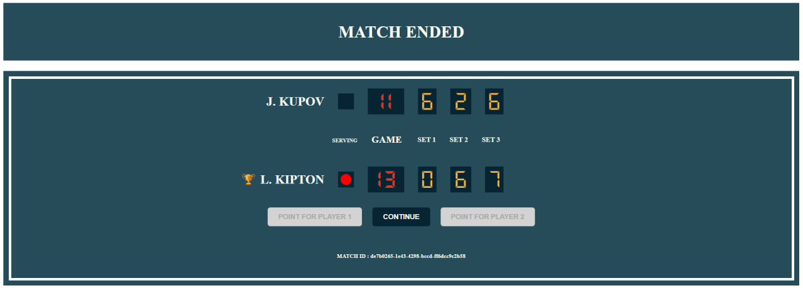
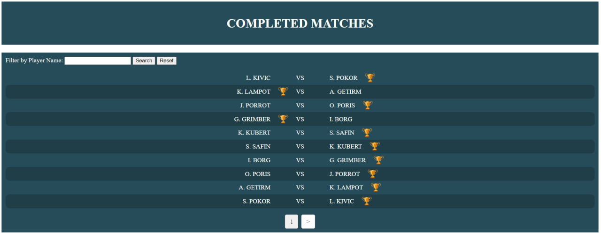

# pet-project-06-tennis-scoreboard
A client-server application with a web interface that implements a tennis match scoreboard.
<h2>Versions used</h2>
<ul>
    <li>JDK 17</li>
    <li>Tomcat 9.0.78</li>
    <li>Hibernate 6.1.7.Final</li>
</ul>

<h2>Technologies used</h2>
<ul>
  <li>Java</li>
  <li>Java servlets</li>
  <li>JSP</li>
  <li>SQL</li>
  <li>H2 (in-memory SQL database)</li>
  <li>Hibernate</li>
  <li>HTML/CSS</li>
  <li>JUnit 5</li>
  <li>Pattern MVC(S)</li>
  <li>Maven</li>
  <li>Apache Tomcat</li>
</ul>

<h2>Project motivation</h2>
<ul>
    <li>Create a client-server application with a web interface</li>
     <li>Get hands-on experience with ORM Hibernate</li>
     <li>Create a simple web interface without third-party libraries</li>
     <li>Get to know the MVC(S) architectural pattern</li>
</ul>
<h2>Application functionality</h2>
Working with matches:
<ul>
     <li>Creating a new match</li>
     <li>View completed matches, search for matches by player names</li>
     <li>Counting points in the current match</li>
</ul>

